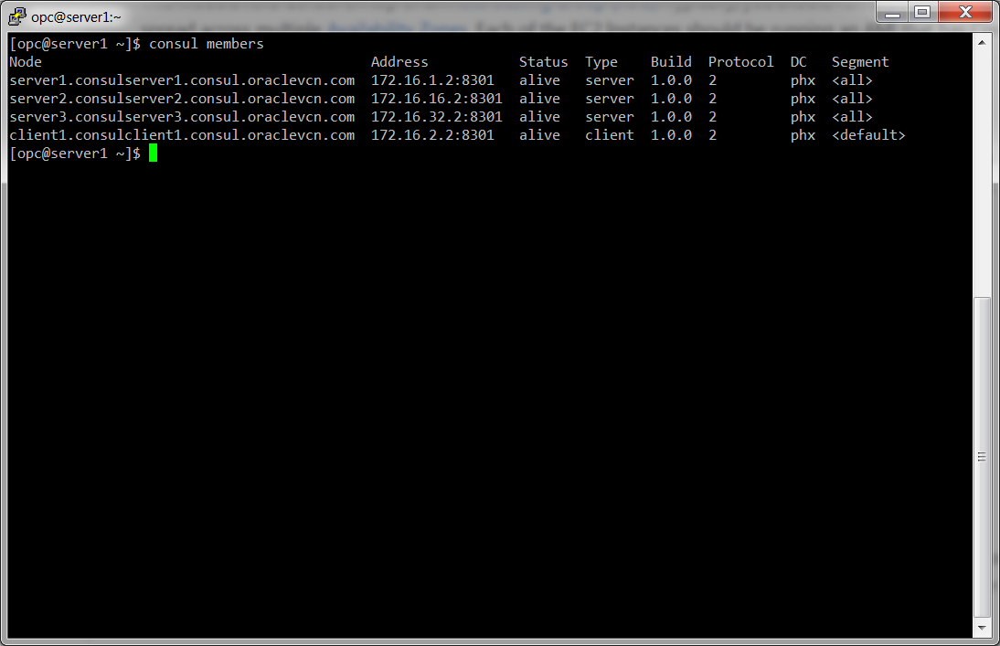
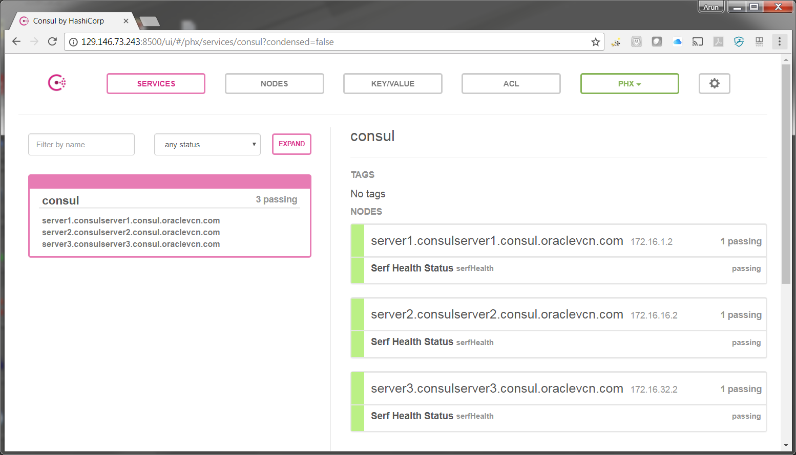

# Consul Cluster

This folder contains a [Terraform](https://www.terraform.io/) module to deploy a [Consul](https://www.consul.io/) cluster on [Oracle Cloud Infrastructure (OCI)](https://cloud.oracle.com/en_US/cloud-infrastructure). This module is designed to deploy an [OCI Custom Image](https://docs.us-phoenix-1.oraclecloud.com/Content/Compute/Tasks/managingcustomimages.htm?Highlight=Image) that has Consul installed using the [install-consul](../install-consul) module.


## How do you use this module?

This folder defines a [Terraform module](https://www.terraform.io/docs/modules/usage.html), which you can use in your code by adding a `module` configuration and setting its `source` parameter to URL of this folder:

```hcl
module "consul_cluster" {
  # TODO: Update this to the final URL
  source = "git::ssh://git@orahub.oraclecorp.com/pts-cloud-dev/terraform-modules//terraform-oci-consul/modules/consul-cluster"
  
  # Specify the OCID of the Consul Image. You should build this using the install-consul module.
  image = "${var.image}"

  # Specify the cluster name. This will be added to each OCI Compute Instance's display name.
  cluster_name = "${var.cluster_name}"
  
  # Specify the tag name for each OCI Compute Instance. This will be added to each OCI Compute Instance's display name.
  tag = "${var.server_tag}"

  # Configure and start Consul during boot. It will automatically form a cluster with all nodes that have the same cluster name.
  user_data = "${base64encode(<<-EOF
#!/usr/bin/env bash
set -e
/opt/consul/bin/run-consul --server \
                           --cluster-name "${var.cluster_name}" \
                           --server-tag "${var.server_tag}" \
                           --oci-tenancy-ocid "${var.tenancy_ocid}" \
                           --oci-region "${var.region}" \
                           --oci-user-ocid "${var.user_ocid}" \
                           --oci-fingerprint "${var.fingerprint}" \
                           --oci-private-key "${var.private_key}"
EOF
)}"

  # ... See variables.tf for other parameters you must define for the consul-cluster module
}
```

Note the following parameters:

* `source`: Use this parameter to specify the URL of the consul-cluster module. The double slash (`//`) is intentional and required. Terraform uses it to specify subfolders within a Git repo (see [module sources](https://www.terraform.io/docs/modules/sources.html)).

* `image`: Use this parameter to specify the [OCID](https://docs.us-phoenix-1.oraclecloud.com/Content/General/Concepts/identifiers.htm) of the Consul [OCI Custom Image](https://docs.us-phoenix-1.oraclecloud.com/Content/Compute/Tasks/managingcustomimages.htm?Highlight=Image) created using the [install-consul](../install-consul) module to deploy on each [Compute Instance](https://docs.us-phoenix-1.oraclecloud.com/Content/Compute/Concepts/computeoverview.htm) in the cluster.

* `user_data`: Use this parameter to specify the [User Data](http://cloudinit.readthedocs.io/en/latest/topics/format.html) script that each server will run during boot. This is where you can use the [run-consul](../run-consul) script to configure and run Consul. The `run-consul` script is one of the scripts installed by the [install-consul](../install-consul) module.

You can find the other parameters in [variables.tf](variables.tf).

Check out the [main example](../../README.md) for fully-working sample code.


## How do you connect to the Consul cluster?


### Using the HTTP API from your own computer

If you want to connect to the cluster from your own computer, the easiest way is to use the [HTTP API](https://www.consul.io/docs/agent/http.html). Note that this only works if the Consul cluster is running in public subnet and/or your default VCN (as in the [main example](../../README.md)), which is OK for testing and experimentation, but NOT recommended for production usage.

To use the HTTP API, you first need to get the public IP address of one of the Consul Servers. You can find Consul servers by using cluster name and server tag.

You can use one of the IP address with the `members` command to see a list of cluster nodes:



```
[opc@server1 ~]$ consul members -http-addr=129.146.73.243:8500
Node                                        Address           Status  Type    Build  Protocol  DC   Segment
server1.consulserver1.consul.oraclevcn.com  172.16.1.2:8301   alive   server  1.0.0  2         phx  <all>
server2.consulserver2.consul.oraclevcn.com  172.16.16.2:8301  alive   server  1.0.0  2         phx  <all>
server3.consulserver3.consul.oraclevcn.com  172.16.32.2:8301  alive   server  1.0.0  2         phx  <all>
client1.consulclient1.consul.oraclevcn.com  172.16.2.2:8301   alive   client  1.0.0  2         phx  <default>
client2.consulclient2.consul.oraclevcn.com  172.16.17.2:8301  alive   client  1.0.0  2         phx  <default>
client3.consulclient3.consul.oraclevcn.com  172.16.33.2:8301  alive   client  1.0.0  2         phx  <default>
client4.consulclient1.consul.oraclevcn.com  172.16.2.2:8301   alive   client  1.0.0  2         phx  <default>
client5.consulclient2.consul.oraclevcn.com  172.16.17.2:8301  alive   client  1.0.0  2         phx  <default>
client6.consulclient3.consul.oraclevcn.com  172.16.33.2:8301  alive   client  1.0.0  2         phx  <default>
```

You can also try inserting a value:

```
[opc@server1 ~]$ consul kv put -http-addr=129.146.73.243:8500 foo bar
Success! Data written to: foo
```

And reading that value back:

```
[opc@server1 ~]$ consul kv get -http-addr=129.146.73.243:8500 foo
bar
```

Finally, you can try opening up the Consul UI in your browser at the URL `http://129.146.73.243:8500/ui/`.




## What's included in this module?

This module creates the following architecture:


This architecture consists of the following resources:

* [OCI Compute Instances](#oci-compute-instances)
* [OCI Subnets](#oci-subnets)
* [OCI Security List](#oci-security-list)


### OCI Compute Instances

This module runs Consul on top of [OCI Compute Instances](https://cloud.oracle.com/en_US/infrastructure/compute). Typically, you should run the Consul servers with 3 or 5 OCI Compute Instances spread across multiple [Availability Domains](https://docs.us-phoenix-1.oraclecloud.com/Content/General/Concepts/regions.htm?Highlight=Availability%20Domain). Each of the OCI Compute Instances should be running an Image that has Consul installed via the [install-consul](../install-consul) module. You pass in the [OCID](https://docs.us-phoenix-1.oraclecloud.com/Content/General/Concepts/identifiers.htm) of the Image to run using the `image` input parameter.

### OCI Subnets

Each OCI Compute Instance in the [Oracle Cloud Infrastructure (OCI)](https://cloud.oracle.com/en_US/cloud-infrastructure) is created in a [OCI Subnet](https://docs.us-phoenix-1.oraclecloud.com/Content/Network/Tasks/managingVCNs.htm). Once OCI Subnet is created per Availability Domain.


### OCI Security List

Each OCI Compute Instance in the [Oracle Cloud Infrastructure (OCI)](https://cloud.oracle.com/en_US/cloud-infrastructure) has a [OCI Security List](https://docs.us-phoenix-1.oraclecloud.com/Content/Network/Concepts/securitylists.htm) that allows:

* All outbound requests
* All the inbound ports specified in the [Consul documentation](https://www.consul.io/docs/agent/options.html?#ports-used)

The Security List OCID is exported as an output variable if you need to add it to other OCI subnets.

Check out the [Security section](#security) for more details.


## What happens if a node crashes?

1. The Consul process may crash. In that case, `supervisor` should restart it automatically.


## Security

Here are some of the main security considerations to keep in mind when using this module:

1. [Encryption in transit](#encryption-in-transit)
1. [Security groups](#security-groups)
1. [SSH access](#ssh-access)


### Encryption in transit

Consul can encrypt all of its network traffic. For instructions on enabling network encryption, have a look at the [How do you handle encryption documentation](../run-consul#how-do-you-handle-encryption).


### Security groups

This module attaches a security list to each OCI Compute Instance that allows inbound requests as follows:

* **Consul**: For all the [ports used by Consul](https://www.consul.io/docs/agent/options.html#ports), you can use the `allowed_inbound_cidr_blocks` parameter to control the list of [CIDR blocks](https://en.wikipedia.org/wiki/Classless_Inter-Domain_Routing) that will be allowed access.

* **SSH**: For the SSH port (default: 22), you can use the `allowed_ssh_cidr_blocks` parameter to control the list of [CIDR blocks](https://en.wikipedia.org/wiki/Classless_Inter-Domain_Routing) that will be allowed access.

Note that all the ports mentioned above are configurable via the `xxx_port` variables (e.g. `server_rpc_port`). See [variables.tf](variables.tf) for the full list.


### SSH access

You can associate an [SSH Key Pair](https://docs.us-phoenix-1.oraclecloud.com/Content/GSG/Tasks/creatingkeys.htm) with each of the OCI Compute Instances in this cluster by specifying the Public Key Value in the `ssh_public_key` variable.


## What's NOT included in this module?

This module does NOT handle the following items, which you may want to provide on your own:

* [VCN, Internet Gateway, Route Tables](#vcn-internet-gateway-route-tables)
* [IAM](#iam)


### VCN, Internet Gateway, Route Tables

This module assumes you've already created your network topology (VPC, subnets, route tables, etc). You will need to pass in the the relevant info about your network topology (e.g. `vpc_id`, `subnet_ids`) as input variables to this module.


### IAM

This module does not creates OCI Identity User, Group and Policy.
