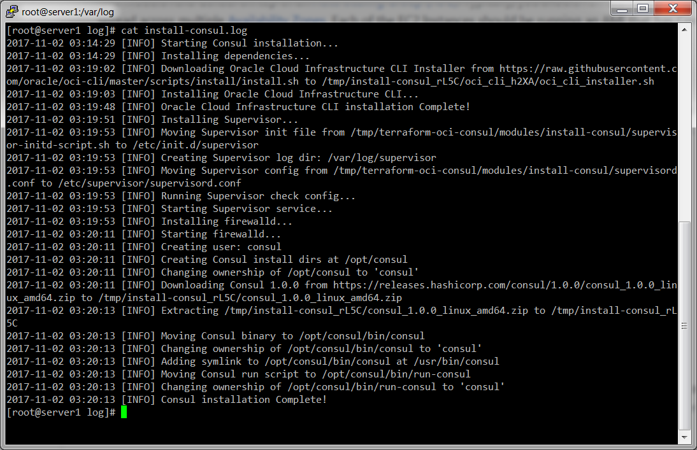

# Consul Install Script

This folder contains a script for installing [Consul](https://www.consul.io/) and its dependencies. Use this script along with the [Packer template](../../examples/consul-image#quick-start) to create a Consul [OCI Custom Image](https://docs.us-phoenix-1.oraclecloud.com/Content/Compute/Tasks/managingcustomimages.htm?Highlight=Image) that can be deployed in [Oracle Cloud Infrastructure (OCI)](https://cloud.oracle.com/en_US/cloud-infrastructure) across [OCI Compute Instances](https://cloud.oracle.com/en_US/infrastructure/compute) using the [consul-cluster module](../consul-cluster) and [run-consul script](../run-consul).

This script has been tested on the following operating systems:
* Oracle Linux 7.4

There is a good chance it will work on other flavors of Debian, CentOS, and RHEL as well.


## Quick start

To install Consul, use `git` to clone this repository and run the `install-consul` script:

```
git clone https://orahub.oraclecorp.com/pts-cloud-dev/terraform-modules//terraform-oci-consul/modules/install-consul
terraform-oci-consul/modules/install-consul/install-consul --consul-version 1.0.0
```

The `install-consul` script will install Consul, its dependencies, and the [run-consul script](../run-consul). The `run-consul` script is also run when the server is booting to start Consul and configure it to automatically join other nodes to form a cluster.

We recommend running the `install-consul` script as part of a [Packer](https://www.packer.io/) template to create a Consul [OCI Custom Image](https://docs.us-phoenix-1.oraclecloud.com/Content/Compute/Tasks/managingcustomimages.htm?Highlight=Image) (see the [consul-image example](../../examples/consul-image) for a fully-working sample code). You can then deploy the Image across [OCI Compute Instances](https://cloud.oracle.com/en_US/infrastructure/compute) using the [consul-cluster module](../consul-cluster) (see the [main example](../../README.md) for fully-working sample code).


## Command line Arguments

The `install-consul` script accepts the following arguments:

* `consul-version VERSION`: (Optional) Install Consul version VERSION. Default is `1.0.0`.
* `consul-dir DIR`: (Optional) Install Consul into folder DIR. Default is `/opt/consul`.
* `consul-user USER`: (Optional) The install dirs will be owned by user USER. Default is `consul`.

Example:
```
install-consul --consul-version 1.0.0
```


## How it works

The `install-consul` script does the following:

1. [Create a user and folders for Consul](#create-a-user-and-folders-for-consul)
1. [Install Consul binaries and scripts](#install-consul-binaries-and-scripts)
1. [Install supervisord](#install-supervisord)
1. [Follow-up tasks](#follow-up-tasks)


### Create a user and folders for Consul

Create an OS user named `consul`. Create the following folders, all owned by user `consul`:

* `/opt/consul`: base directory for Consul data (configurable via the `--consul-dir` argument).
* `/opt/consul/bin`: directory for Consul binaries.
* `/opt/consul/data`: directory where the Consul agent can store state.
* `/opt/consul/config`: directory where the Consul agent looks up configuration.
* `/opt/consul/log`: directory where Consul will store log output.


### Install Consul binaries and scripts

Install the following:

* `consul`: Download the Consul zip file from the [downloads page](https://www.consul.io/downloads.html) (the version number is configurable via the `--consul-version` argument), and extract the `consul` binary into `/opt/consul/bin`. Add a symlink to the `consul` binary in `/usr/local/bin`.
* `run-consul`: Copy the [run-consul script](../run-consul) into `/opt/consul/bin`.


### Install supervisord

Install [supervisord](http://supervisord.org/). We use it as a cross-platform supervisor to ensure Consul is started whenever the system boots and restarted if the Consul process crashes.


### Follow-up tasks

After the `install-consul` script finishes running, you may wish to do the following:

1. If you have custom Consul config (`.json`) files, you may want to copy them into the config directory (default: `/opt/consul/config`).
1. If `/usr/local/bin` isn't already part of `PATH`, you should add it so you can run the `consul` command without specifying the full path.


## How do you check the logs?

You can check the `install-consul` logs in `/var/log/install-consul.log` or `/var/log/messages`.



