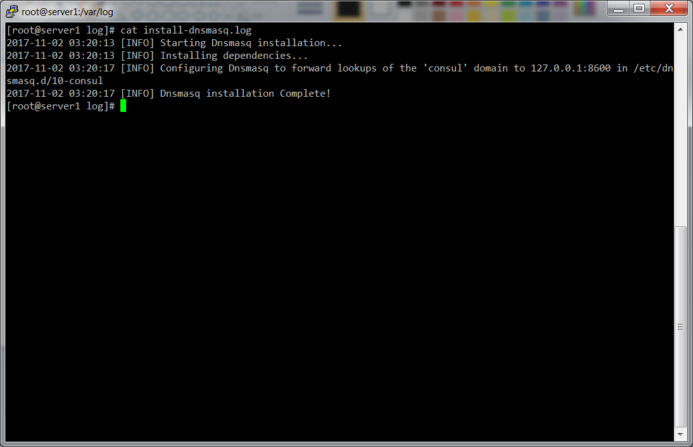

# Dnsmasq Install Script

This folder contains a script for installing [Dnsmasq](http://www.thekelleys.org.uk/dnsmasq/doc.html) on [Oracle Cloud Infrastructure (OCI)](https://cloud.oracle.com/en_US/cloud-infrastructure) and configuring it to forward requests for a specific domain to [Consul](https://www.consul.io/). This way, you can easily use Consul as your DNS server for domain names such as `foo.service.consul`, where `foo` is a service registered with Consul (see the [Registering Services docs](https://www.consul.io/intro/getting-started/services.html) for instructions on registering your services with Consul). All other domain names will continue to be resolved via the default resolver on your OS. See the [Consul DNS Forwarding Guide](https://www.consul.io/docs/guides/forwarding.html) for more info.

This script has been tested on the following operating systems:
* Oracle Linux 7.4

There is a good chance it will work on other flavors of Debian, CentOS, and RHEL as well.


## Quick start

To install Dnsmasq, use `git` to clone this repository and run the `install-dnsmasq` script:

```
git clone https://orahub.oraclecorp.com/pts-cloud-dev/terraform-modules//terraform-oci-consul/modules/install-dnsmasq
terraform-oci-consul/modules/install-dnsmasq/install-dnsmasq
```

Note: by default, the `install-dnsmasq` script assumes that a Consul agent is already running locally and connected to a Consul cluster. After the install completes, restart `dnsmasq` (e.g. `sudo /etc/init.d/dnsmasq restart`) and queries to the `.consul` domain will be resolved via Consul:

```
dig foo.service.consul
```

We recommend running the `install-dnsmasq` script as part of a [Packer](https://www.packer.io/) template to create a Consul [OCI Custom Image](https://docs.us-phoenix-1.oraclecloud.com/Content/Compute/Tasks/managingcustomimages.htm?Highlight=Image) (see the [consul-image example](../../examples/consul-image) for sample code).


## Command line Arguments

The `install-dnsmasq` script accepts the following arguments:

* `consul-domain DOMAIN`: (Optional) The domain name to point to Consul. Default is `consul`.
* `consul-ip IP_ADDRESS`: (Optional) The IP address to use for Consul. Default is `127.0.0.1`. This assumes a Consul agent is
  running locally and connected to a Consul cluster.
* `consul-dns-port PORT`: (Optional) The port Consul uses for DNS requests. Default is `8600`.

Example:

```
install-dnsmasq
```


## How do you check the logs?

You can check the `install-dnsmasq` logs in `/var/log/install-dnsmasq.log` or `/var/log/messages`.




## Troubleshooting

Add the `+trace` argument to `dig` commands to more clearly see what's going on:

```
dig vault.service.consul +trace
```
