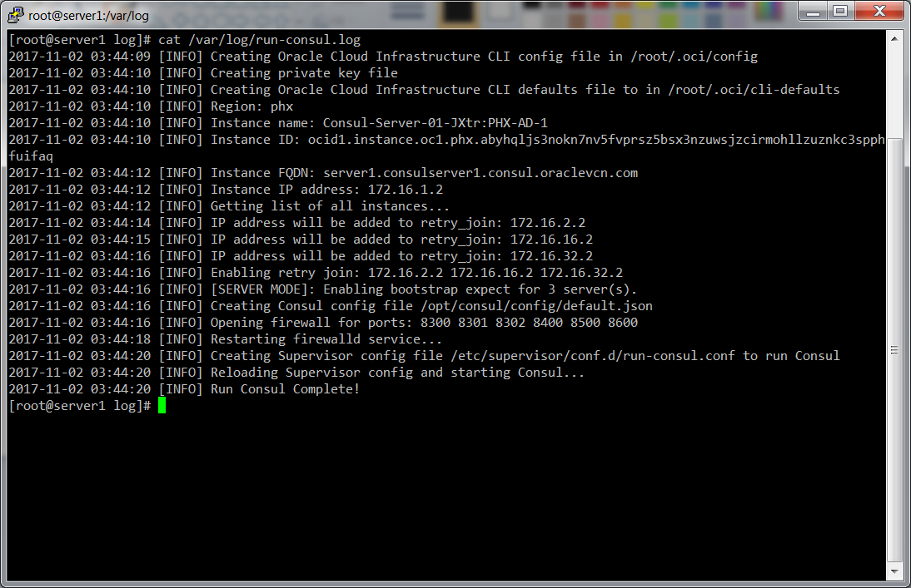

# Consul Run Script

This folder contains a script for configuring and running [Consul](https://www.consul.io/) on [Oracle Cloud Infrastructure (OCI)](https://cloud.oracle.com/en_US/cloud-infrastructure).

This script has been tested on the following operating systems:
* Oracle Linux 7.4

There is a good chance it will work on other flavors of Debian, CentOS, and RHEL as well.


## Quick start

This script assumes that you installed it, plus all of its dependencies (including Consul itself), using the [install-consul module](../install-consul). The default install path is `/opt/consul/bin`, so to start Consul in server mode, you run:

```
/opt/consul/bin/run-consul --server
```

To start Consul in client mode, you run:

```
/opt/consul/bin/run-consul --client
```

This will:

1. Generate a [Oracle Cloud Infrastructure CLI](https://docs.us-phoenix-1.oraclecloud.com/Content/API/SDKDocs/cli.htm) configuration file at ` ~/.oci/config`. See [Oracle Cloud Infrastructure CLI configuration](https://docs.us-phoenix-1.oraclecloud.com/Content/API/Concepts/sdkconfig.htm) for details on what this configuration file will contain.

1. Generate a Consul configuration file called `default.json` in the Consul config dir (default: `/opt/consul/config`). See [Consul configuration](#consul-configuration) for details on what this configuration file will contain and how to override it with your own configuration.

1. Generate a [Supervisor](http://supervisord.org/) configuration file called `run-consul.conf` in the Supervisor config dir (default: `/etc/supervisor/conf.d`) with a command that will run Consul:
`consul agent -config-dir=/opt/consul/config -data-dir=/opt/consul/data`

1. Tell Supervisor to load the new configuration file, thereby starting Consul.

We recommend using the `run-consul` command as part of [User Data](http://cloudinit.readthedocs.io/en/latest/topics/format.html), so that it executes when the [OCI Compute Instance](https://cloud.oracle.com/en_US/infrastructure/compute) is first booting. After running `run-consul` on that initial boot, the `supervisord` configuration will automatically restart Consul if it crashes or the OCI Compute instance reboots.

See the [root folder](../../README.md#quick-start) for fully-working sample code.


## Command line Arguments

The `run-consul` script accepts the following arguments:

* `server`: (Optional) Set server mode. Exactly one of `--server` or `--client` must be set.
* `client`: (Optional) Set client mode. Exactly one of `--server` or `--client` must be set.
* `cluster-name NAME`: (Required) Automatically form a cluster with OCI Compute Instance(s) that are part of this cluster.
* `server-tag VALUE`: (Required in `--server` mode) Automatically bootstrap when server(s) with this tag are available.
* `config-dir PATH`: (Optional) The path to the Consul config folder. Default is to take the absolute path of `../config`, relative to the `run-consul` script itself.
* `data-dir PATH`: (Optional) The path to the Consul config folder. Default is to take the absolute path of `../data`, relative to the `run-consul` script itself.
* `log-dir PATH`: (Optional) The path to the Consul log folder. Default is to take the absolute path of `../log`, relative to the `run-consul` script itself.
* `bin-dir PATH`: (Optional) The path to the Consul bin folder. Default is to take the absolute path of `../bin`, relative to the `run-consul` script itself.
* `user USER`: (Optional) The user to run Consul as. Default is to use the owner of `config-dir`.
* `oci-user-ocid OCID`: (Required unless `--skip-oci-config` is set) Set OCID of the user to access the Oracle Cloud Infrastructure API's.
* `oci-fingerprint FINGERPRINT`: (Required unless `--skip-oci-config` is set) Set fingerprint of the user provided by `--oci-user-ocid` to access the Oracle Cloud Infrastructure API's.
* `oci-private-key VALUE`: (Required unless `--skip-oci-config` is set) Set RSA private key value that matches the fingerprint provided by `--oci-fingerprint`.
* `oci-tenancy-ocid OCID`: (Required unless `--skip-oci-config` is set) Set OCID of the Tenancy in Oracle Cloud Infrastructure.
* `oci-region REGION`: (Required unless `--skip-oci-config` is set) Set the Region in Oracle Cloud Infrastructure.
* `ports PORT,...`: (Optional) Set ports to open for Consul communication. Defaults as specified in the [Consul documentation](https://www.consul.io/docs/agent/options.html?#ports-used)
* `skip-oci-config`: (Optional) If this flag is set, don't generate Oracle Cloud Infrastructure CLI configuration file.
* `skip-consul-config`: (Optional) If this flag is set, don't generate a Consul configuration file. This is useful if you have a custom configuration file and don't want to use any of of the default settings from `run-consul`.

Example:

```
/opt/consul/bin/run-consul --server --cluster-name consul-cluster --server-tag dev-server --oci-user-ocid ${USER_OCID} --oci-fingerprint ${FINGERPRINT} --oci-private-key ${PRIVATE_KEY} --oci-tenancy-ocid ${TENANCY_OCID} --oci-region us-phoenix-1
```
Note: The parameter values can come from the environment variables.


## Consul configuration

`run-consul` generates a configuration file for Consul called `default.json` that tries to figure out reasonable defaults for a Consul cluster in [Oracle Cloud Infrastructure](https://cloud.oracle.com/en_US/cloud-infrastructure/). Check out the [Consul Configuration Files documentation](https://www.consul.io/docs/agent/options.html#configuration-files) for what configuration settings are available.


### Default configuration

`run-consul` sets the following configuration values by default:

* [advertise_addr](https://www.consul.io/docs/agent/options.html#advertise_addr): Set to the OCI Compute Instance's private IP address, as fetched from [Metadata](https://docs.us-phoenix-1.oraclecloud.com/Content/Compute/Tasks/gettingmetadata.htm).

* [bind_addr](https://www.consul.io/docs/agent/options.html#bind_addr): Set to the OCI Compute Instance's private IP address, as fetched from [Metadata](https://docs.us-phoenix-1.oraclecloud.com/Content/Compute/Tasks/gettingmetadata.htm).

* [bootstrap_expect](https://www.consul.io/docs/agent/options.html#bootstrap_expect): If `--server` is set, set this config based on the OCI Compute Instance's `--server-tag` tag (using the [Oracle Cloud Infrastructure CLI](https://docs.us-phoenix-1.oraclecloud.com/Content/API/SDKDocs/cli.htm)).

* [client_addr](https://www.consul.io/docs/agent/options.html#client_addr): Set to 0.0.0.0 so you can access the client and UI endpoint on each OCI Compute Instance from the outside.

* [datacenter](https://www.consul.io/docs/agent/options.html#datacenter): Set to the current OCI Region (e.g. `phx`), as fetched from [Metadata](https://docs.us-phoenix-1.oraclecloud.com/Content/Compute/Tasks/gettingmetadata.htm).

* [node_name](https://www.consul.io/docs/agent/options.html#node_name): Set to the FQDN hostname of the instance. Fetched using the [Oracle Cloud Infrastructure CLI](https://docs.us-phoenix-1.oraclecloud.com/Content/API/SDKDocs/cli.htm).

* [retry_join](https://www.consul.io/docs/agent/options.html#retry_join): Look up the OCI Compute Instances names (using the [Oracle Cloud Infrastructure CLI](https://docs.us-phoenix-1.oraclecloud.com/Content/API/SDKDocs/cli.htm)) and `--cluster-name` to get the Private IP addresses of other instances in the cluster.

* [server](https://www.consul.io/docs/agent/options.html#server): Set to true if `--server` is set.

* [ui](https://www.consul.io/docs/agent/options.html#ui): Set to true.


### Overriding the configuration

To override the default configuration, simply put your own configuration file in the Consul config folder (default: `/opt/consul/config`), but with a name that comes later in the alphabet than `default.json` (e.g. `my-custom-config.json`). Consul will load all the `.json` configuration files in the config dir and [merge them together in alphabetical order](https://www.consul.io/docs/agent/options.html#_config_dir), so that settings in files that come later in the alphabet will override the earlier ones.

For example, to override the default `retry_join` settings, you could create a file called `tags.json` with the contents:

```json
{
  "retry_join": [
    "172.16.1.1",
    "172.16.2.1",
    "172.16.3.1"
  ]
}
```

If you want to override *all* the default settings, you can tell `run-consul` not to generate a default config file at all using the `--skip-consul-config` flag:

```
/opt/consul/bin/run-consul --server --skip-consul-config
```

If you want to override *all* the Oracle Cloud Infrastructure CLI settings, you can tell `run-consul` not to generate a OCI CLI config file at all using the `--skip-oci-config` flag:

```
/opt/consul/bin/run-consul --server --skip-oci-config
```

## How do you check the logs?

You can check the `run-consul` logs in `/var/log/run-consul.log` or `/var/log/messages`.




## How do you handle encryption?

Consul can encrypt all of its network traffic (see the [encryption docs for details](https://www.consul.io/docs/agent/encryption.html)), but by default, encryption is not enabled in this Module. To enable encryption, you need to do the following:

1. [Gossip encryption: provide an encryption key](#gossip-encryption-provide-an-encryption-key)
1. [RPC encryption: provide TLS certificates](#rpc-encryption-provide-tls-certificates)


### Gossip encryption: provide an encryption key

To enable Gossip encryption, you need to provide a 16-byte, Base64-encoded encryption key, which you can generate using the [consul keygen command](https://www.consul.io/docs/commands/keygen.html). You can put the key in a Consul configuration file (e.g. `encryption.json`) in the Consul config dir (default location: `/opt/consul/config`):

```json
{
  "encrypt": "cg8StVXbQJ0gPvMd9o7yrg=="
}
```


### RPC encryption: provide TLS certificates

To enable RPC encryption, you need to provide the paths to the CA and signing keys ([here is a tutorial on generating these keys](http://russellsimpkins.blogspot.com/2015/10/consul-adding-tls-using-self-signed.html)). You can specify these paths in a Consul configuration file (e.g. `encryption.json`) in the Consul config dir (default location: `/opt/consul/config`):

```json
{
  "ca_file": "/opt/consul/tls/certs/ca-bundle.crt",
  "cert_file": "/opt/consul/tls/certs/my.crt",
  "key_file": "/opt/consul/tls/private/my.key"
}
```

You will also want to set the [verify_incoming](https://www.consul.io/docs/agent/options.html#verify_incoming) and [verify_outgoing](https://www.consul.io/docs/agent/options.html#verify_outgoing) settings to verify TLS certs on incoming and outgoing connections, respectively:

```json
{
  "ca_file": "/opt/consul/tls/certs/ca-bundle.crt",
  "cert_file": "/opt/consul/tls/certs/my.crt",
  "key_file": "/opt/consul/tls/private/my.key",
  "verify_incoming": true,
  "verify_outgoing": true
}
```
